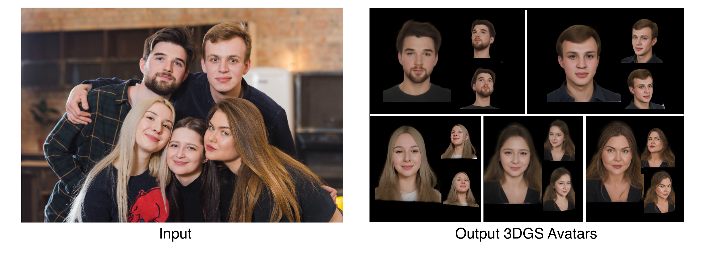

# SplatShot: 3D Face Avatar Generation from a Single Unconstrained Photo

[Hao Liang](https://hliang2.github.io/)¹ &nbsp;·&nbsp; [Zhixuan Ge](TODO)¹ &nbsp;·&nbsp; [Soumendu Majee](TODO)² &nbsp;·&nbsp; [Joanna Li](TODO)¹ &nbsp;·&nbsp; [Ashok Veeraraghavan](TODO)¹ &nbsp;·&nbsp; [Guha Balakrishnan](TODO)¹

¹ Rice University &nbsp;·&nbsp; ² Samsung Research America

[[Paper]](http://arxiv.org/abs/2606.01493) &nbsp;|&nbsp; [[Project Page]](https://hliang2.github.io/SplatShot/) &nbsp;|&nbsp; [[CelebA-3D]](https://hliang2.github.io/celeba-3d/) (dataset using SplatShot)

---



Given a single in-the-wild photo, SplatShot generates a photorealistic 3D Gaussian Splatting (3DGS) face avatar renderable from arbitrary viewpoints — no per-subject training required.

---

## Setup

### 1. Environment

```bash
git clone https://github.com/hliang2/SplatShot.git
cd SplatShot

conda create -n splatshot python=3.10 -y
conda activate splatshot

# PyTorch (cu121 — adjust if your CUDA driver differs)
pip install torch==2.5.1+cu121 torchvision==0.20.1+cu121 --index-url https://download.pytorch.org/whl/cu121

# Remaining dependencies (use --no-build-isolation so CUDA extensions compile against the torch above)
pip install -r requirements.txt --no-build-isolation
```

### 2. External model weights

**Face parsing** (BiSeNet, for ControlNet segmentation):

```bash
git clone https://github.com/zllrunning/face-parsing.PyTorch
# Download the pretrained weight to: face-parsing.PyTorch/res/cp/79999_iter.pth
```

IP-Adapter and ControlNet weights are downloaded automatically from HuggingFace Hub on first run.

### 3. Base 3DGS template

Two base templates are bundled in this repo. Set `FIXED_BASE` at the top of `inference.py` to select one:

- `333_EXP-1_v16_DS4_whiteBg_staticOffset_maskBelowLine` — recommended for **short-hair** subjects (default)
- `288_EXP-1_v16_DS4_whiteBg_staticOffset_maskBelowLine` — recommended for **long-hair** subjects

Full 3DGS base library will be released soon.

---

## Inference

```bash
python inference.py --image ./photo.jpg
```

| Flag | Default | Description |
|---|---|---|
| `--image` | required | Path to input photo |
| `--output_dir` | `./output` | Output directory |
| `--device` | `cuda` | `cuda` or `cpu` |
| `--num_views` | all | Subsample to N views (fewer = faster, less 3D coverage) |

Results are written to `output/<image_stem>/`:

```
output/<image_stem>/
├── avatar.ply        — final 3DGS (open in SuperSplat, Gaussian Splatting Viewer, etc.)
├── base.ply          — matched base model before refinement
├── input.jpg         — copy of your input photo
├── diffusion/        — per-view diffusion images + intermediate visualizations
└── cameras/          — COLMAP cameras needed to render the PLY
```

---

## Requirements

| | |
|---|---|
| GPU | 24 GB VRAM recommended (tested on A100) |
| Runtime | ~10–15 min per image (25 steps, all 48 views) |
| Python | 3.10+ |

---

## Project structure

```
SplatShot/
├── inference.py                   — single entry point
├── download_bases.py              — download the base template from HuggingFace
├── precompute_assets.py           — one-time: ControlNet assets for the base template
├── requirements.txt
├── core/
│   ├── gs_model.py               — GaussianModel, GaussianRenderer, GaussianTrainer
│   ├── sampler.py                — DDIM sampler with chunked VAE encode/decode
│   ├── diffusion_wrapper.py      — SD 1.5 + ControlNet + IP-Adapter
│   └── semantic_transplant.py   — Semantic Delta Injection (SDI)
├── pipelines/
│   └── _shared_3dgs_guidance.py — 3DGS-guided denoising loop
└── utils/
    ├── colmap.py                 — COLMAP dataset parser
    ├── face_utils.py             — face parsing, landmarks, ArcFace ID
    └── gsplat.py                 — gsplat rasterization helpers
```

---

## Acknowledgments

- [gsplat](https://github.com/nerfstudio-project/gsplat) — 3DGS rasterization
- [Diffusers](https://github.com/huggingface/diffusers) — diffusion pipeline infrastructure
- [IP-Adapter](https://github.com/tencent-ailab/IP-Adapter) — identity conditioning
- [ControlNet](https://github.com/lllyasviel/ControlNet) — pose and segmentation conditioning
- [NeRSemble](https://github.com/tobias-kirschstein/nersemble) — base 3DGS face models
- [face-parsing.PyTorch](https://github.com/zllrunning/face-parsing.PyTorch) — face segmentation
